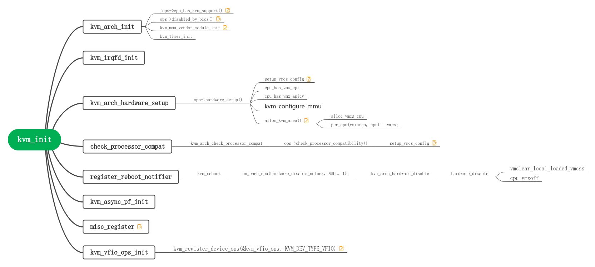
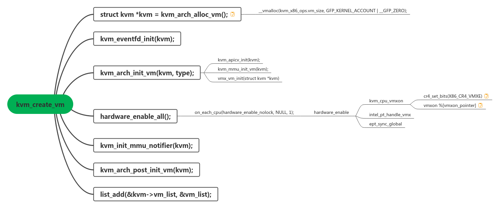
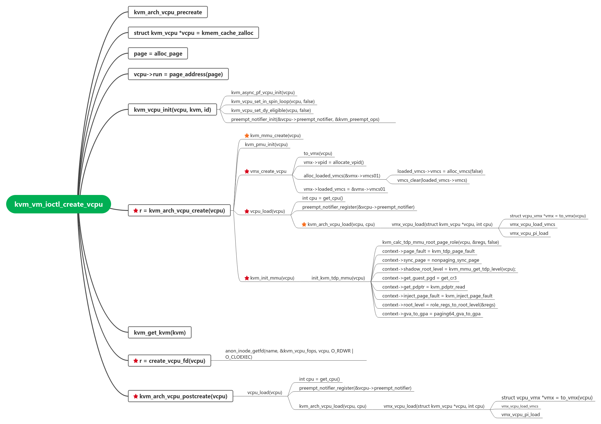

[TOC]

# `CPU`虚拟化

内核版本`linux-5.17.5`

`kvmtool`: http://git.kernel.org/pub/scm/linux/kernel/git/will/kvmtool.git

对于虚拟化的学习，本系列以`linux-5.17.5`以及`kvmtool`为工具。

## `KVM`初始化

初始化`KVM`时，需要加载`kvm.ko`以及`kvm-intel.ko`两个内核模块。其中`kvm.ko`由`KVM`的通用代码生成，`kvm-intel.ko`是由`Intel CPU`架构相关代码生成。最终`kvmtool`和`kvm`的交互由`kvm.ko`导出的设备`/dev/kvm`完成。

整个`KVM`的初始化由函数`vmx_init`来完成，其主要调用了`kvm_init`函数。

```c
static int __init vmx_init(void)
{
    int r, cpu;
    r = kvm_init(&vmx_init_ops, sizeof(struct vcpu_vmx),
             __alignof__(struct vcpu_vmx), THIS_MODULE);
    ...
    return 0;
}
```

函数`kvm_init`中的`vmx_init_ops`参数表示`Intel VT-x`实现的各种回调函数:

```c
static struct kvm_x86_init_ops vmx_init_ops __initdata = {
    .cpu_has_kvm_support = cpu_has_kvm_support,
    .disabled_by_bios = vmx_disabled_by_bios,
    .check_processor_compatibility = vmx_check_processor_compat,
    .hardware_setup = hardware_setup,
    .handle_intel_pt_intr = NULL,

    .runtime_ops = &vmx_x86_ops,
};
```

`vmx_init_ops`中内嵌变量`runtime_ops`由`vmx_x86_ops`指定。可以看到`vmx_x86_ops`才是真正的`Intel VT-x`回调函数集合：

```c
static struct kvm_x86_ops vmx_x86_ops __initdata = {
    .name = "kvm_intel",

    .hardware_unsetup = hardware_unsetup,

    .hardware_enable = hardware_enable,
    .hardware_disable = hardware_disable,
    .cpu_has_accelerated_tpr = report_flexpriority,
    .has_emulated_msr = vmx_has_emulated_msr,

    .vm_size = sizeof(struct kvm_vmx),
    .vm_init = vmx_vm_init,

    .vcpu_create = vmx_create_vcpu,
    .vcpu_free = vmx_free_vcpu,
    .vcpu_reset = vmx_vcpu_reset,

    .prepare_guest_switch = vmx_prepare_switch_to_guest,
    .vcpu_load = vmx_vcpu_load,
    .vcpu_put = vmx_vcpu_put,

    .update_exception_bitmap = vmx_update_exception_bitmap,
    .get_msr_feature = vmx_get_msr_feature,
    .get_msr = vmx_get_msr,
    .set_msr = vmx_set_msr,
    .get_segment_base = vmx_get_segment_base,
    .get_segment = vmx_get_segment,
    .set_segment = vmx_set_segment,
    .get_cpl = vmx_get_cpl,
    .get_cs_db_l_bits = vmx_get_cs_db_l_bits,
    .set_cr0 = vmx_set_cr0,
    .is_valid_cr4 = vmx_is_valid_cr4,
    .set_cr4 = vmx_set_cr4,
    .set_efer = vmx_set_efer,
    .get_idt = vmx_get_idt,
    .set_idt = vmx_set_idt,
    .get_gdt = vmx_get_gdt,
    .set_gdt = vmx_set_gdt,
    .set_dr7 = vmx_set_dr7,
    .sync_dirty_debug_regs = vmx_sync_dirty_debug_regs,
    .cache_reg = vmx_cache_reg,
    .get_rflags = vmx_get_rflags,
    .set_rflags = vmx_set_rflags,
    .get_if_flag = vmx_get_if_flag,

    .tlb_flush_all = vmx_flush_tlb_all,
    .tlb_flush_current = vmx_flush_tlb_current,
    .tlb_flush_gva = vmx_flush_tlb_gva,
    .tlb_flush_guest = vmx_flush_tlb_guest,

    .vcpu_pre_run = vmx_vcpu_pre_run,
    .run = vmx_vcpu_run,
    .handle_exit = vmx_handle_exit,
    .skip_emulated_instruction = vmx_skip_emulated_instruction,
    .update_emulated_instruction = vmx_update_emulated_instruction,
    .set_interrupt_shadow = vmx_set_interrupt_shadow,
    .get_interrupt_shadow = vmx_get_interrupt_shadow,
    .patch_hypercall = vmx_patch_hypercall,
    .set_irq = vmx_inject_irq,
    .set_nmi = vmx_inject_nmi,
    .queue_exception = vmx_queue_exception,
    .cancel_injection = vmx_cancel_injection,
    .interrupt_allowed = vmx_interrupt_allowed,
    .nmi_allowed = vmx_nmi_allowed,
    .get_nmi_mask = vmx_get_nmi_mask,
    .set_nmi_mask = vmx_set_nmi_mask,
    .enable_nmi_window = vmx_enable_nmi_window,
    .enable_irq_window = vmx_enable_irq_window,
    .update_cr8_intercept = vmx_update_cr8_intercept,
    .set_virtual_apic_mode = vmx_set_virtual_apic_mode,
    .set_apic_access_page_addr = vmx_set_apic_access_page_addr,
    .refresh_apicv_exec_ctrl = vmx_refresh_apicv_exec_ctrl,
    .load_eoi_exitmap = vmx_load_eoi_exitmap,
    .apicv_post_state_restore = vmx_apicv_post_state_restore,
    .check_apicv_inhibit_reasons = vmx_check_apicv_inhibit_reasons,
    .hwapic_irr_update = vmx_hwapic_irr_update,
    .hwapic_isr_update = vmx_hwapic_isr_update,
    .guest_apic_has_interrupt = vmx_guest_apic_has_interrupt,
    .sync_pir_to_irr = vmx_sync_pir_to_irr,
    .deliver_interrupt = vmx_deliver_interrupt,
    .dy_apicv_has_pending_interrupt = pi_has_pending_interrupt,

    .set_tss_addr = vmx_set_tss_addr,
    .set_identity_map_addr = vmx_set_identity_map_addr,
    .get_mt_mask = vmx_get_mt_mask,

    .get_exit_info = vmx_get_exit_info,

    .vcpu_after_set_cpuid = vmx_vcpu_after_set_cpuid,

    .has_wbinvd_exit = cpu_has_vmx_wbinvd_exit,

    .get_l2_tsc_offset = vmx_get_l2_tsc_offset,
    .get_l2_tsc_multiplier = vmx_get_l2_tsc_multiplier,
    .write_tsc_offset = vmx_write_tsc_offset,
    .write_tsc_multiplier = vmx_write_tsc_multiplier,

    .load_mmu_pgd = vmx_load_mmu_pgd,

    .check_intercept = vmx_check_intercept,
    .handle_exit_irqoff = vmx_handle_exit_irqoff,

    .request_immediate_exit = vmx_request_immediate_exit,

    .sched_in = vmx_sched_in,

    .cpu_dirty_log_size = PML_ENTITY_NUM,
    .update_cpu_dirty_logging = vmx_update_cpu_dirty_logging,

    .pmu_ops = &intel_pmu_ops,
    .nested_ops = &vmx_nested_ops,

    .update_pi_irte = pi_update_irte,
    .start_assignment = vmx_pi_start_assignment,

#ifdef CONFIG_X86_64
    .set_hv_timer = vmx_set_hv_timer,
    .cancel_hv_timer = vmx_cancel_hv_timer,
#endif

    .setup_mce = vmx_setup_mce,

    .smi_allowed = vmx_smi_allowed,
    .enter_smm = vmx_enter_smm,
    .leave_smm = vmx_leave_smm,
    .enable_smi_window = vmx_enable_smi_window,

    .can_emulate_instruction = vmx_can_emulate_instruction,
    .apic_init_signal_blocked = vmx_apic_init_signal_blocked,
    .migrate_timers = vmx_migrate_timers,

    .msr_filter_changed = vmx_msr_filter_changed,
    .complete_emulated_msr = kvm_complete_insn_gp,

    .vcpu_deliver_sipi_vector = kvm_vcpu_deliver_sipi_vector,
};
```

如下图所示以`kvm_init`为中心的函数调用图：



函数说明

- `kvm_arch_init`:
  
  - `cpu_has_kvm_support`和`disabled_by_bios`:检测逻辑`cpu`是否支持`VMX`操作，以及是否被`Bios`关闭。
  
  - `kvm_mmu_vendor_module_init`:内存虚拟化初始化。
  
  - `kvm_timer_init`:时间虚拟化初始化。

- `kvm_arch_hardware_setup`:
  
  - `set_vmcs_config`根据当前逻辑`cpu`创建一个全局的`vmcs_config`用于与后续的每一个逻辑`cpu`的`vmcs_conf`做比较，若不一致则退出`KVM`初始化流程。
  - `cpu_has_vmx_ept`和`cpu_has_vmx_apicv`:根据`vmcs_config`和`MSR`值来设置某些全局变量，比如是否支持`EPT`的`enable_ept`变量()。
  - `kvm_configure_mmu`:根据全局变量`enable_ept`设置全局变量`tdp_enabled`以及`max_huge_page_level`。
  - `alloc_kvm_area()`:分配`vmxon`区域，并且放到`vmxarea`这个`percpu`变量中。

- `check_processor_compat`:检测所有的逻辑`cpu`的`vmcs`是否一致。

- `misc_register`:注册`misc`设备`/deev/kvm`。
  
  ```c
  r = misc_register(&kvm_dev);
  static struct miscdevice kvm_dev = {
      KVM_MINOR,
      "kvm",
      &kvm_chardev_ops,
  };
  static struct file_operations kvm_chardev_ops = {
      .unlocked_ioctl = kvm_dev_ioctl,
      .llseek        = noop_llseek,
      KVM_COMPAT(kvm_dev_ioctl),
  };
  ```

通过`misc_register(&kvm_dev)`就注册了`misc`设备`/dev/kvm`，可以看到`/dev/kvm`只支持`ioctl`系统调用。

`kvm_dev_ioctl`代码如下

```c
static long kvm_dev_ioctl(struct file *filp,
              unsigned int ioctl, unsigned long arg)
{
    long r = -EINVAL;

    switch (ioctl) {
    case KVM_GET_API_VERSION:
        if (arg)
            goto out;
        r = KVM_API_VERSION;
        break;
    case KVM_CREATE_VM:
        r = kvm_dev_ioctl_create_vm(arg);
        break;
    case KVM_CHECK_EXTENSION:
        r = kvm_vm_ioctl_check_extension_generic(NULL, arg);
        break;
    case KVM_GET_VCPU_MMAP_SIZE:
        if (arg)
            goto out;
        r = PAGE_SIZE;     /* struct kvm_run */
#ifdef CONFIG_X86
        r += PAGE_SIZE;    /* pio data page */
#endif
#ifdef CONFIG_KVM_MMIO
        r += PAGE_SIZE;    /* coalesced mmio ring page */
#endif
        break;
    case KVM_TRACE_ENABLE:
    case KVM_TRACE_PAUSE:
    case KVM_TRACE_DISABLE:
        r = -EOPNOTSUPP;
        break;
    default:
        return kvm_arch_dev_ioctl(filp, ioctl, arg);
    }
out:
    return r;
}
```

从上述代码可以看到`/dev/kvm`的`ioctl`接口分为两类：

- 通用接口:比如`KVM_API_VERSION`和`KVM_CREATE_VM`。

- 架构相关接口:`kvm_arch_dev_ioctl`。

此外，参见如下图，整个`KVM`还包括`VM`层面的`ioctl`以及`VCPU`层面的`ioctl`。


`KVM`的初始化流程没有使逻辑`cpu`进入`VMX`模式，因为在整个`vmx_init`流程中并没有将`CR4.VMXE[bit 13]`设置为`1`。`VMX`模式的开启是在创建第一个虚拟机的时候。

## 虚拟机的创建

创建`KVM`虚拟机需要用户态的`kvmtool`发起。在`kvmtool`代码中，创建`KVM`虚拟机的流程由`kvm__init`发起。`kvmtool`和`kvm`的交互如下图所示:


### `kvmtool`

- 打开`/dev/kvm`设备文件，获取此设备文件的`fd`。

- 根据`1.`中的`fd`，发起`KVM_CREATE_VM`调用，请求`kvm`创建虚拟机。代码如下：

```c
int kvm__init(struct kvm *kvm)
{
    int ret;

    // kvm__arch_cpu_supports_vm: 使用cpuid指令检测硬件环境是否支持虚拟化
    if (!kvm__arch_cpu_supports_vm()) {
        pr_err("Your CPU does not support hardware virtualization");
        ret = -ENOSYS;
        goto err;
    }

    // open /dev/kvm
    kvm->sys_fd = open(kvm->cfg.dev, O_RDWR);
    ...

    // KVM_GET_API_VERSION: Get the API version as the stable kvm API
    ret = ioctl(kvm->sys_fd, KVM_GET_API_VERSION, 0);
    ...

    // KVM_CREATE_VM: 创建虚拟机
    kvm->vm_fd = ioctl(kvm->sys_fd, KVM_CREATE_VM, kvm__get_vm_type(kvm));
    ...

    // query about extensions to the core kvm API.
    if (kvm__check_extensions(kvm)) {
        pr_err("A required KVM extension is not supported by OS");
        ret = -ENOSYS;
        goto err_vm_fd;
    }

    kvm__arch_init(kvm);
    ...
}
```

### `kvm`

在内核`KVM`模块中，函数`kvm_dev_ioctl`根据`kvmtool`发起`ioctl`调用时传入的`KVM_CREATE_VM`最终调用到`kvm_dev_ioctl_create_vm`函数，

- `kvm_create_vm`:创建虚拟机的核心函数。

- `kvm_coalesced_mmio_init``:对``coalesced MMIO`进行初始化。其实就是分配了一个`struct page`，然后将此`page`所在的虚拟地址赋值给`kvm->coalesced_mmio_ring`。

- `get_unused_fd_flags`:获取一个未被使用的`fd`，此`fd`作为`VM`层面调用`ioctl`时的`fd`。

- `anon_inode_getfile`:创建一个匿名的文件实例。

- `fd_install`:将`get_unused_fd_flags`获取的`fd`和`anon_inode_getfile`创建的匿名文件实例关联起来。

#### `kvm_create_vm`

作为创建虚拟机核心函数，`kvm_create_vm`调用关系如下:



精简后的代码如下所示：

```c
static struct kvm *kvm_create_vm(unsigned long type)
{
    struct kvm *kvm = kvm_arch_alloc_vm();
    struct kvm_memslots *slots;
    int r = -ENOMEM;
    int i, j;
    ...
    mmgrab(current->mm);
    kvm->mm = current->mm;
    kvm_eventfd_init(kvm);
    ...
    xa_init(&kvm->vcpu_array);
    ...
    refcount_set(&kvm->users_count, 1);
    for (i = 0; i < KVM_ADDRESS_SPACE_NUM; i++) {
        for (j = 0; j < 2; j++) {
            slots = &kvm->__memslots[i][j];

            atomic_long_set(&slots->last_used_slot, (unsigned long)NULL);
            slots->hva_tree = RB_ROOT_CACHED;
            slots->gfn_tree = RB_ROOT;
            hash_init(slots->id_hash);
            slots->node_idx = j;

            /* Generations must be different for each address space. */
            slots->generation = i;
        }

        rcu_assign_pointer(kvm->memslots[i], &kvm->__memslots[i][0]);
    }

    for (i = 0; i < KVM_NR_BUSES; i++) {
        rcu_assign_pointer(kvm->buses[i],
            kzalloc(sizeof(struct kvm_io_bus), GFP_KERNEL_ACCOUNT));
        if (!kvm->buses[i])
            goto out_err_no_arch_destroy_vm;
    }

    kvm->max_halt_poll_ns = halt_poll_ns;

    r = kvm_arch_init_vm(kvm, type);
    ...

    r = hardware_enable_all();
    ...

#ifdef CONFIG_HAVE_KVM_IRQFD
    INIT_HLIST_HEAD(&kvm->irq_ack_notifier_list);
#endif

    r = kvm_init_mmu_notifier(kvm);
    ...
    r = kvm_arch_post_init_vm(kvm);
    ...
    list_add(&kvm->vm_list, &vm_list);

    preempt_notifier_inc();
    kvm_init_pm_notifier(kvm);

    /*
     * When the fd passed to this ioctl() is opened it pins the module,
     * but try_module_get() also prevents getting a reference if the module
     * is in MODULE_STATE_GOING (e.g. if someone ran "rmmod --wait").
     */
    if (!try_module_get(kvm_chardev_ops.owner)) {
        r = -ENODEV;
        goto out_err;
    }

    return kvm;

out_err:
    ...
    return ERR_PTR(r);
}
```

- `kvm_arch_alloc_vm`:分配一个`struct kvm`指针，用于表示一台虚拟机。

- `kvm_arch_init_vm`:初始化`struct kvm->arch`变量。

- `hardware_enable_all`:设置`CR4.VMXE[bit 13] = 1`使能`VMX`模式；对每一个逻辑`cpu`调用`vmxon`指令使其进入`VMX`模式。

- `list_add(&kvm->vm_list, &vm_list)`:将`kvm->vm_list`挂到以`vm_list`为头节点的链表上。

## `vCPU`的创建

虚拟机创建完成后，`kvmtool`可以根据其调用`KVM_CREATE_VM`时返回的虚拟机`fd`发起新的`ioctl`调用，请求创建`vCPU`。在`kvmtool`中，每一个`vCPU`对应宿主机操作系统中的一个用户态线程。在创建单个`vCPU`时，`kvmtool`和`kvm`的交互如下图。


图中`kvmtool`侧`vcpu->kvm->vmfd`就是[虚拟机的创建](#虚拟机的创建)中由`KVM_CREATE_VM`返回的虚拟机`fd`。虚拟机`fd`所关联的匿名文件`file_operations`在`kvm`中定义如下：

```c
static struct file_operations kvm_vm_fops = {
    .release        = kvm_vm_release,
    .unlocked_ioctl = kvm_vm_ioctl,
    .llseek        = noop_llseek,
    KVM_COMPAT(kvm_vm_compat_ioctl),
};
```

`kvm`侧函数简介:

- `vcpu = kmem_cache_zalloc`:分配`struct kvm_vcpu`指针变量，此变量是一个`kvm_vcpu_cache`。

- `kvm_vcpu_init(vcpu, kvm, id)`:初始化由`kmem_cache_zalloc`分配的指针变量，将虚拟机所属的`struct kvm`变量和其关联(`vcpu->kvm = kvm` )。

- **`kvm_arch_vcpu_create(vcpu)`**:此函数是创建`vCPU`的核心函数之一，其最终调用了`vmx_x86_ops`中注册的`vmx_create_vcpu`函数。

- `kvm_get_kvm(kvm)`:每创建一个`vCPU`就将该虚拟机对应的`kvm->users_count`加`1`。

- **`create_vcpu_fd(vcpu)`**:为新创建的`vcpu`关联一个匿名文件并且返回此匿名文件的文件描述符作为当前`vcpu`的`fd`，此`fd`返回给`kvmtool`使用；`fd`所关联的`file_operations`为`kvm_vcpu_fops`。
  
- **`kvm_arch_vcpu_postcreate(vcpu)`**: 分别调用`vmx_vcpu_load`和`vmx_vcpu_put`。

### `kvm`

由于在创建`vcpu`时，`kvmtool`侧只需调用`KVM_CREATE_VCPU`即可。因此接下来重点分析`kvm`侧的代码。`kvm`侧代码参考如下图:

#### `kvm_arch_vcpu_create`

从上图可以看到，`kvm`侧创建`vCPU`时`kvm_arch_vcpu_create`扮演了及其重要的角色:

- 调用`vmx_create_vcpu`函数:

  ```c
  static int vmx_create_vcpu(struct kvm_vcpu *vcpu)
  {
  	struct vmx_uret_msr *tsx_ctrl;
  	struct vcpu_vmx *vmx;
  	int i, err;
      ...
  	vmx = to_vmx(vcpu);
  	INIT_LIST_HEAD(&vmx->pi_wakeup_list);
  	vmx->vpid = allocate_vpid();
  	...
  	err = alloc_loaded_vmcs(&vmx->vmcs01);
  	...
  	vmx->loaded_vmcs = &vmx->vmcs01;
  	...
  	return 0;
  	...
  free_vpid:
  	free_vpid(vmx->vpid);
  	return err;
  }
  ```

  1. 调用`alloc_loaded_vmcs`分配`struct vmcs`结构。将新分配的`vmcs`所关联的逻辑`cpu`字段设置为`-1(loaded_vmcs->cpu = -1)`，表示此`vmcs`未绑定到任何逻辑`cpu`；将新分配的`vmcs`所关联的`launche`设置为`0`表示此`vmcs`为非`launched`，后续`VM entry`应该使用`VMLAUNCH`指令，若`loaded_vmcs->launched == 1`，后续`VM entry`应该使用`VMRESUME`指令。

     ```c
     int alloc_loaded_vmcs(struct loaded_vmcs *loaded_vmcs)
     {
         loaded_vmcs->vmcs = alloc_vmcs(false);
         ...;
         vmcs_clear(loaded_vmcs->vmcs);
         ...;
         loaded_vmcs->cpu = -1;
     	loaded_vmcs->launched = 0;
         ...
     }
     ```

     `struct loaded_vmcs`定义如下:

     ```c
     /*
      * Track a VMCS that may be loaded on a certain CPU. If it is (cpu!=-1), also
      * remember whether it was VMLAUNCHed, and maintain a linked list of all VMCSs
      * loaded on this CPU (so we can clear them if the CPU goes down).
      */
     struct loaded_vmcs {
     	struct vmcs *vmcs;
     	struct vmcs *shadow_vmcs;
     	int cpu;
     	bool launched;
     	bool nmi_known_unmasked;
     	bool hv_timer_soft_disabled;
     	/* Support for vnmi-less CPUs */
     	int soft_vnmi_blocked;
     	ktime_t entry_time;
     	s64 vnmi_blocked_time;
     	unsigned long *msr_bitmap;
     	struct list_head loaded_vmcss_on_cpu_link;
     	struct vmcs_host_state host_state;
     	struct vmcs_controls_shadow controls_shadow;
     };
     ```

     `struct vmcs`定义如下:

     ```c
     struct vmcs {
     	struct vmcs_hdr hdr;
     	u32 abort;
     	char data[];
     };
     ```

     `struct vmcs_hdr`:

     ```c
     struct vmcs_hdr {
     	u32 revision_id:31;
     	u32 shadow_vmcs:1;
     };
     ```

     根据`Intel SDM`描述:

     - `vmcs.vmcs_hdr.revision_id`表示`VMCS revision`标识符，占用第一个`4`字节数据的`0-30`位。
     - `vmcs.vmcs_hdr.shadow_vmcs`占用第一个`4`字节数据的第`31`位，指示当前`vmcs`是否为`shadow-VMCS`。
     - `vmcs.abort`完全占用第二个`4`字节数据，表示`VMX`中止指示，`VM-Exit`执行不成功时产生`VMX`中止，`CPU`会在此处存入`VMX`中止的原因，以方便调试。
     - **`vmcs.data`为`vmcs`的数据域，此字段中的数据是特定于`cpu`的。**

     

     2. 在非嵌套虚拟化环境下，将`vmx->loaded_vmcs`设置为`&vmx->vmcs01`，参考如下说明:

        > ​	/*
        >
        > ​     ** loaded_vmcs points to the VMCS currently used in this vcpu. For a*
        >
        > ​     ** non-nested (L1) guest, it always points to vmcs01. For a nested*
        >
        > ​     ** guest (L2), it points to a different VMCS.*
        >
        > ​     **/*

- 经由`vcpu_load(vcpu)`调用`vmx_vcpu_load(struct kvm_vcpu *vcpu, int cpu)`，最后调用`vmx_vcpu_load_vmcs(*vcpu*, *cpu*, NULL)`中的`vmcs_load`函数将`vmcs`与当前逻辑`cpu`绑定。如下函数逻辑见代码中

  ```c
  void vmx_vcpu_load_vmcs(struct kvm_vcpu *vcpu, int cpu,
  			struct loaded_vmcs *buddy)
  {
  	struct vcpu_vmx *vmx = to_vmx(vcpu);
      /*
       * vmcs关联的逻辑cpu是否是当前逻辑cpu,以此作为vmcs是否已经loaded的依据
       */
  	bool already_loaded = vmx->loaded_vmcs->cpu == cpu;
  	struct vmcs *prev;
  
      /*
       * vmcs未被loaded
       */
  	if (!already_loaded) {
  		loaded_vmcs_clear(vmx->loaded_vmcs);
  		local_irq_disable();
  
  		/*
  		 * Ensure loaded_vmcs->cpu is read before adding loaded_vmcs to
  		 * this cpu's percpu list, otherwise it may not yet be deleted
  		 * from its previous cpu's percpu list.  Pairs with the
  		 * smb_wmb() in __loaded_vmcs_clear().
  		 */
  		smp_rmb();
  
          /*
           * 将vmx->loaded_vmcs添加到当前逻辑cpu的loaded_vmcss_on_cpu链表上
           */
  		list_add(&vmx->loaded_vmcs->loaded_vmcss_on_cpu_link,
  			 &per_cpu(loaded_vmcss_on_cpu, cpu));
  		local_irq_enable();
  	}
  
      /*
       * 取出当前逻辑cpu的current_vmcs与vmx->loaded_vmcs->vmcs做比较
       * 若不相等，表示需要更新当前逻辑cpu的current_vmcs
       * 然后使用vmptrld指令将vmx->loaded_vmcs->vmcs与当前逻辑cpu绑定
       */
  	prev = per_cpu(current_vmcs, cpu);
  	if (prev != vmx->loaded_vmcs->vmcs) {
  		per_cpu(current_vmcs, cpu) = vmx->loaded_vmcs->vmcs;
  		vmcs_load(vmx->loaded_vmcs->vmcs);
          ...
  	}
  
  	if (!already_loaded) {
  		...;
  		/*
  		 * 将vmx->loaded_vmcs所关联的逻辑cpu设置为当前逻辑cpu
  		 */
  		vmx->loaded_vmcs->cpu = cpu;
  	}
  }
  ```

- `kvm_vcpu_reset(vcpu, false)`最终调用`vmx_vcpu_reset`，`vmx_set_cr0`，`vmx_set_cr4`，`vmx_set_eferr`，`vmx_update_exception_bitmap`设置`vmcs`中`data`域的值。设置`vmcs`时，由函数`vmcs_writeX`执行`vmwrite`指令写相关的域。

#### `kvm_get_kvm`

`kvm_get_kvm`函数将`struct kvm`中的成员变量`users_count`原子的加`1`，表示引用此`struct kvm`的成员数量。

```c
void kvm_get_kvm(struct kvm *kvm)
{
	refcount_inc(&kvm->users_count);
}
EXPORT_SYMBOL_GPL(kvm_get_kvm);
```

在调用`kvm_put_kvm`函数时，首先检测`kvm->users_count`是否为`0`，若为`0`则销毁虚拟机。代码参见如下:

```c
void kvm_put_kvm(struct kvm *kvm)
{
	if (refcount_dec_and_test(&kvm->users_count))
		kvm_destroy_vm(kvm);
}
EXPORT_SYMBOL_GPL(kvm_put_kvm);
```

#### `create_vcpu_fd`

为新创建的`vcpu`关联一个匿名文件并且返回此匿名文件的文件描述符作为当前`vcpu-fd`，此`vcpu-fd`返回给`kvmtool`使用。

```c
/*
 * Allocates an inode for the vcpu.
 */
static int create_vcpu_fd(struct kvm_vcpu *vcpu)
{
	char name[8 + 1 + ITOA_MAX_LEN + 1];

	snprintf(name, sizeof(name), "kvm-vcpu:%d", vcpu->vcpu_id);
	return anon_inode_getfd(name, &kvm_vcpu_fops, vcpu, O_RDWR | O_CLOEXEC);
}
```

`vcpu-fd`所关联的`file_operations`为`kvm_vcpu_fops`:

```c
static struct file_operations kvm_vcpu_fops = {
    .release        = kvm_vcpu_release,
    .unlocked_ioctl = kvm_vcpu_ioctl,
    .mmap           = kvm_vcpu_mmap,
    .llseek        = noop_llseek,
    KVM_COMPAT(kvm_vcpu_compat_ioctl),
};
```

#### `kvm_arch_vcpu_postcreate`

根据代码看，`kvm_arch_vcpu_postcreate`最终调用了`vmx_vcpu_load`以及`vmx_vcpu_put`。根据之前`kvm_arch_vcpu_create`流程分析，此时在`kvm_arch_vcpu_postcreate`中调用`vmx_vcpu_load`和`vmx_vcpu_put`的作用不是太清楚。

至此，整个`KVM_CREATE_VCPU`的流程就分析完毕了。

## `kvmtool`与`kvm`之间的共享数据

在执行`KVM_RUN`调用之前，`kvmtool`与`kvm`需要分配一块共享内存用于共享数据。首先，`kvmtool`调用`KVM_GET_VCPU_MMAP_SIZE`获取此共享内存的大小，然后使用`mmap`在`kvmtool`进程的虚拟地址空间创建一个新的映射。代码参考如下:

```c
mmap_size = ioctl(vcpu->kvm->sys_fd, KVM_GET_VCPU_MMAP_SIZE, 0);
...;
vcpu->kvm_run = mmap(NULL, mmap_size, PROT_RW, MAP_SHARED, vcpu->vcpu_fd, 0);
```

### `kvm`

从`kvmtool`代码可以看到，`KVM_GET_VCPU_MMAP_SIZE`在调用`ioctl`时使用的文件描述符为`kvm-fd`，因此其入口是`kvm_dev_ioctl`。

```c
static long kvm_dev_ioctl(struct file *filp,
			  unsigned int ioctl, unsigned long arg)
{
	long r = -EINVAL;

	switch (ioctl) {
	...;
	case KVM_GET_VCPU_MMAP_SIZE:
		if (arg)
			goto out;
		r = PAGE_SIZE;     /* struct kvm_run */
#ifdef CONFIG_X86
		r += PAGE_SIZE;    /* pio data page */
#endif
#ifdef CONFIG_KVM_MMIO
		r += PAGE_SIZE;    /* coalesced mmio ring page */
#endif
		break;
        ...;
```

上述代码说明在`kvmtool`在调用`KVM_GET_VCPU_MMAP_SIZE`后`mmap_size`的大小最小为`1`个`PAGE_SIZE`，最多为`3`个`PAGE_SIZE`。第一个页面用于`struct kvm_run`，第二个页面用于`pio data page`，第三个页面用于`coalesced mmio ring page`。具体的大小与`CONFIG_X86`以及`CONFIG_KVM_MMIO`有关。可参见内核关于`KVM_GET_VCPU_MMAP_SIZE`的文档说明:

```c
4.5 KVM_GET_VCPU_MMAP_SIZE
--------------------------

:Capability: basic
:Architectures: all
:Type: system ioctl
:Parameters: none
:Returns: size of vcpu mmap area, in bytes

The KVM_RUN ioctl (cf.) communicates with userspace via a shared
memory region.  This ioctl returns the size of that region.  See the
KVM_RUN documentation for details.

Besides the size of the KVM_RUN communication region, other areas of
the VCPU file descriptor can be mmap-ed, including:

- if KVM_CAP_COALESCED_MMIO is available, a page at
  KVM_COALESCED_MMIO_PAGE_OFFSET * PAGE_SIZE; for historical reasons,
  this page is included in the result of KVM_GET_VCPU_MMAP_SIZE.
  KVM_CAP_COALESCED_MMIO is not documented yet.

- if KVM_CAP_DIRTY_LOG_RING is available, a number of pages at
  KVM_DIRTY_LOG_PAGE_OFFSET * PAGE_SIZE.  For more information on
  KVM_CAP_DIRTY_LOG_RING, see section 8.3.
```

`kvmtool`得到共享内存的大小后在`vcpu-fd`上调用`mmap`，`vcpu-fd`所关联的`file_operations`为`kvm_vcpu_fops`因此会调用到`kvm_vcpu_mmap`:

```c
static int kvm_vcpu_mmap(struct file *file, struct vm_area_struct *vma)
{
	struct kvm_vcpu *vcpu = file->private_data;
	unsigned long pages = vma_pages(vma);

	if ((kvm_page_in_dirty_ring(vcpu->kvm, vma->vm_pgoff) ||
	     kvm_page_in_dirty_ring(vcpu->kvm, vma->vm_pgoff + pages - 1)) &&
	    ((vma->vm_flags & VM_EXEC) || !(vma->vm_flags & VM_SHARED)))
		return -EINVAL;
	
    // 设置 vma->vm_ops 为kvm_vcpu_vm_ops
	vma->vm_ops = &kvm_vcpu_vm_ops;
	return 0;
}
```

可以看到，`kvmtool`调用`mmap`映射`vcpu-fd`关联的匿名文件时，仅仅分配了虚拟地址空间，然后设置这段虚拟地址空间的操作为`kvm_vcpu_vm_ops`，该操作只有一个`fault`回调函数`kvm_vcpu_fault`。

```c
static const struct vm_operations_struct kvm_vcpu_vm_ops = {
	.fault = kvm_vcpu_fault,
};
```

`kvm_vcpu_fault`函数会在`kvmtool`访问共享内存产生缺页异常的时候被调用:

```c
static vm_fault_t kvm_vcpu_fault(struct vm_fault *vmf)
{
	struct kvm_vcpu *vcpu = vmf->vma->vm_file->private_data;
	struct page *page;

	if (vmf->pgoff == 0)
		page = virt_to_page(vcpu->run);
#ifdef CONFIG_X86
	else if (vmf->pgoff == KVM_PIO_PAGE_OFFSET)
		page = virt_to_page(vcpu->arch.pio_data);
#endif
#ifdef CONFIG_KVM_MMIO
	else if (vmf->pgoff == KVM_COALESCED_MMIO_PAGE_OFFSET)
		page = virt_to_page(vcpu->kvm->coalesced_mmio_ring);
#endif
	else if (kvm_page_in_dirty_ring(vcpu->kvm, vmf->pgoff))
		page = kvm_dirty_ring_get_page(
		    &vcpu->dirty_ring,
		    vmf->pgoff - KVM_DIRTY_LOG_PAGE_OFFSET);
	else
		return kvm_arch_vcpu_fault(vcpu, vmf);
	get_page(page);
	vmf->page = page;
	return 0;
}
```

根据代码:

- 访问第一页的时候，实际上会访问到`struct kvm_vcpu`中的`run(struct kvm_run)`成员。
- 访问第二页的时候，实际上会访问到`struct kvm_vcpu`中的`arch(struct kvm_vcpu_arch)`成员。
- 访问第三页的时候，实际上会访问到当前`struct kvm`中的`coalesced_mmio_ring`成员。

如果访问的地址超过了指定的长度，则调用`kvm_arch_vcpu_fault`返回`VM_FAULT_SIGBUS`:

```c
vm_fault_t kvm_arch_vcpu_fault(struct kvm_vcpu *vcpu, struct vm_fault *vmf)
{
	return VM_FAULT_SIGBUS;
}
```

## `vCPU`的运行

在旧版本的`Intel SDM`中，描述了让一个虚拟机运行起来的步骤:

1. 在非分页内存中分配一个`4KB`对齐的`vmcs`区域，其大小通过`IA32_VMX_BASIC MSR`得到。对于`kvm`，这个过程主要是通过`vmx_create_vcpu`调用`alloc_vmcs`来完成。
1. 初始化`vmcs`的版本标识，这个过程在`alloc_vmcs_cpu`中完成。
1. 使用`vmcs`的物理地址`hpa`作为操作数执行`vmclear`指令，这个过程主要通过`loaded_vmcs_clear`函数最终调用`vmcs_clear`来完成。如果操作数是指向`current vmcs`的指针，执行`vmclear`指令后，指针会被置为`FFFFFFFF_FFFFFFFFH`。
1. 使用`vmcs`的物理地址作为操作数执行`vmptrld`。这个过程由`vmx_cpu_load`调用`vmcs_load`来完成。
1. 执行`vmwrite`指令设置初始化`vmcs`，在`kvm`中这个过程由`vmx_vcpu_reset`完成。
1. 执行`vmlaunch`指令，使得当前逻辑`cpu`处于`VMX non-root`模式。这个过程由`vmx_vcpu_run`来完成。

步骤`1-5`在本文档之前已经做个分析，`6`就是本小节的重点。同样，`vCPU`运行需要`kvmtool`和`kvm`配合一起才能完成。在`kvmtool`侧一个`vCPU`其实对应一个用户态线程，其创建完成后，会进入循环状态，等待条件满足时开始运行虚拟机代码。虚拟机执行敏感指令或收到外部中断时，便会触发`VM-Exit`进入`kvm`模块处理；部分`VM-Exit`甚至会退出到`kvmtool`中进行处理。如下代码为`kvmtool`中创建`vCPU`线程:

```c
static int kvm_cmd_run_work(struct kvm *kvm)
{
	int i;

	for (i = 0; i < kvm->nrcpus; i++) {
        // 根据kvm->nrcpus创建vcpu线程
		if (pthread_create(&kvm->cpus[i]->thread, NULL, kvm_cpu_thread, kvm->cpus[i]) != 0)
			die("unable to create KVM VCPU thread");
	}

	/* Only VCPU #0 is going to exit by itself when shutting down */
	if (pthread_join(kvm->cpus[0]->thread, NULL) != 0)
		die("unable to join with vcpu 0");

	return kvm_cpu__exit(kvm);
}
```

`kvmtool`和`kvm`交互如下图所示:


- `kvm_cpu__setup_cpuid`:使用`KVM_SET_CPUID2`调用`ioctl`设置`vCPU`对`CPUID`指令的响应。
- `kvm_cpu__setup_sregs`:使用`KVM_SET_SREGS`调用`ioctl`设置`vCPU`中特殊寄存器`(cs,ss,ds,es,fs,gs)`的值。
- `kvm_cpu__setup_regs`:使用`KVM_SET_REGS`调用`ioctl`设置`vCPU`中寄存器`(rflags,rip,rsp,rbp)`的值。
- `kvm_cpu__setup_fpu`:使用`KVM_SET_FPU`调用`ioctl`设置`vCPU`中`float point state`。
- `kvm_cpu__setup_msrs`:使用`KVM_SET_MSRS`调用`ioctl`设置`vCPU`中的`model-specific registers`。
- **`kvm_cpu__run`**:**使用`KVM_RUN`调用`ioctl`运行`vCPU`。**

**`kvm_cpu__start`**注册虚拟机相关的信号处理函数，设置`vCPU`的某些状态以及根据`vCPU`是否`running`注入`NMI`，然后调用`kvm_cpu__run`执行`ioctl(vcpu->vcpu_fd, KVM_RUN, 0)`。当`vCPU`发生`VM-Exit`并且`kvm`无法处理此类型退出，就返回到`kvmtool`中根据`cpu->kvm_run->exit_reason`进行处理。

```c
int kvm_cpu__start(struct kvm_cpu *cpu)
{
	sigset_t sigset;

	sigemptyset(&sigset);
	sigaddset(&sigset, SIGALRM);

	pthread_sigmask(SIG_BLOCK, &sigset, NULL);

	signal(SIGKVMEXIT, kvm_cpu_signal_handler);
	signal(SIGKVMPAUSE, kvm_cpu_signal_handler);
	signal(SIGKVMTASK, kvm_cpu_signal_handler);

	kvm_cpu__reset_vcpu(cpu);

	if (cpu->kvm->cfg.single_step)
		kvm_cpu__enable_singlestep(cpu);

	while (cpu->is_running) {
		if (cpu->needs_nmi) {
			kvm_cpu__arch_nmi(cpu);
			cpu->needs_nmi = 0;
		}

		if (cpu->task)
			kvm_cpu__run_task(cpu);

		kvm_cpu__run(cpu);

		switch (cpu->kvm_run->exit_reason) {
		case KVM_EXIT_UNKNOWN:
			break;
		case KVM_EXIT_DEBUG:
			kvm_cpu__show_registers(cpu);
			kvm_cpu__show_code(cpu);
			break;
		case KVM_EXIT_IO: {
			bool ret;
			
            // 模拟IO
			ret = kvm_cpu__emulate_io(cpu,
						  cpu->kvm_run->io.port,
						  (u8 *)cpu->kvm_run +
						  cpu->kvm_run->io.data_offset,
						  cpu->kvm_run->io.direction,
						  cpu->kvm_run->io.size,
						  cpu->kvm_run->io.count);

			if (!ret)
				goto panic_kvm;
			break;
		}
		case KVM_EXIT_MMIO: {
			bool ret;

			/*
			 * If we had MMIO exit, coalesced ring should be processed
			 * *before* processing the exit itself
			 */
			kvm_cpu__handle_coalesced_mmio(cpu);

			ret = kvm_cpu__emulate_mmio(cpu,
						    cpu->kvm_run->mmio.phys_addr,
						    cpu->kvm_run->mmio.data,
						    cpu->kvm_run->mmio.len,
						    cpu->kvm_run->mmio.is_write);

			if (!ret)
				goto panic_kvm;
			break;
		}
		case KVM_EXIT_INTR:
			if (cpu->is_running)
				break;
			goto exit_kvm;
		case KVM_EXIT_SHUTDOWN:
			goto exit_kvm;
		case KVM_EXIT_SYSTEM_EVENT:
			/*
			 * Print the type of system event and
			 * treat all system events as shutdown request.
			 */
			switch (cpu->kvm_run->system_event.type) {
			default:
				pr_warning("unknown system event type %d",
					   cpu->kvm_run->system_event.type);
				/* fall through for now */
			case KVM_SYSTEM_EVENT_RESET:
				/* Fall through for now */
			case KVM_SYSTEM_EVENT_SHUTDOWN:
				/*
				 * Ensure that all VCPUs are torn down,
				 * regardless of which CPU generated the event.
				 */
				kvm__reboot(cpu->kvm);
				goto exit_kvm;
			};
			break;
		default: {
			bool ret;

			ret = kvm_cpu__handle_exit(cpu);
			if (!ret)
				goto panic_kvm;
			break;
		}
		}
		kvm_cpu__handle_coalesced_mmio(cpu);
	}

exit_kvm:
	return 0;

panic_kvm:
	return 1;
}
```

执行`ioctl(vcpu->vcpu_fd, KVM_RUN, 0)`进入`kvm`的流程如下:

```c
kvm_arch_vcpu_ioctl_run(vcpu);->
    vcpu_run(vcpu);->
    	vcpu_enter_guest(vcpu);->
    		static_call(kvm_x86_run)(vcpu);->
    			vmx_vcpu_run(vcpu);->
    				vmx_vcpu_enter_exit(vcpu, vmx);->
						__vmx_vcpu_run(vmx, (unsigned long *)&vcpu->arch.regs, vmx->loaded_vmcs->launched)(arch/x86/kvm/vmx/vmenter.S);->
    						vmx_vmenter
```

最终调用`__vmx_vcpu_run`函数进入`vCPU`运行的真正入口，其中`(unsigned long *)&vcpu->arch.regs`是由`kvm`保存`vCPU`的通用寄存器。

> `System V AMD64 ABI` 将前六个整型或指针参数依次使用寄存器 `rdi, rsi, rdx, rcx, r8, r9`。···

```assembly
/**
 * __vmx_vcpu_run - Run a vCPU via a transition to VMX guest mode
 * @vmx:	struct vcpu_vmx * (forwarded to vmx_update_host_rsp)
 * @regs:	unsigned long * (to guest registers)
 * @launched:	%true if the VMCS has been launched
 *
 * Returns:
 *	0 on VM-Exit, 1 on VM-Fail
 */
SYM_FUNC_START(__vmx_vcpu_run)
	push %_ASM_BP
	mov  %_ASM_SP, %_ASM_BP
#ifdef CONFIG_X86_64
	push %r15
	push %r14
	push %r13
	push %r12
#else
	push %edi
	push %esi
#endif
	push %_ASM_BX

	/*
	 * Save @regs, _ASM_ARG2 may be modified by vmx_update_host_rsp() and
	 * @regs is needed after VM-Exit to save the guest's register values.
	 */
	push %_ASM_ARG2

	/* Copy @launched to BL, _ASM_ARG3 is volatile. */
	mov %_ASM_ARG3B, %bl

	/* Adjust RSP to account for the CALL to vmx_vmenter(). */
	lea -WORD_SIZE(%_ASM_SP), %_ASM_ARG2
	call vmx_update_host_rsp

	/* Load @regs to RAX. */
	mov (%_ASM_SP), %_ASM_AX

	/* Check if vmlaunch or vmresume is needed */
	testb %bl, %bl

	/* Load guest registers.  Don't clobber flags. */
	mov VCPU_RCX(%_ASM_AX), %_ASM_CX
	mov VCPU_RDX(%_ASM_AX), %_ASM_DX
	mov VCPU_RBX(%_ASM_AX), %_ASM_BX
	mov VCPU_RBP(%_ASM_AX), %_ASM_BP
	mov VCPU_RSI(%_ASM_AX), %_ASM_SI
	mov VCPU_RDI(%_ASM_AX), %_ASM_DI
#ifdef CONFIG_X86_64
	mov VCPU_R8 (%_ASM_AX),  %r8
	mov VCPU_R9 (%_ASM_AX),  %r9
	mov VCPU_R10(%_ASM_AX), %r10
	mov VCPU_R11(%_ASM_AX), %r11
	mov VCPU_R12(%_ASM_AX), %r12
	mov VCPU_R13(%_ASM_AX), %r13
	mov VCPU_R14(%_ASM_AX), %r14
	mov VCPU_R15(%_ASM_AX), %r15
#endif
	/* Load guest RAX.  This kills the @regs pointer! */
	mov VCPU_RAX(%_ASM_AX), %_ASM_AX

	/* Enter guest mode */
	call vmx_vmenter

	/* Jump on VM-Fail. */
	jbe 2f

	/* Temporarily save guest's RAX. */
	push %_ASM_AX

	/* Reload @regs to RAX. */
	mov WORD_SIZE(%_ASM_SP), %_ASM_AX

	/* Save all guest registers, including RAX from the stack */
	pop           VCPU_RAX(%_ASM_AX)
	mov %_ASM_CX, VCPU_RCX(%_ASM_AX)
	mov %_ASM_DX, VCPU_RDX(%_ASM_AX)
	mov %_ASM_BX, VCPU_RBX(%_ASM_AX)
	mov %_ASM_BP, VCPU_RBP(%_ASM_AX)
	mov %_ASM_SI, VCPU_RSI(%_ASM_AX)
	mov %_ASM_DI, VCPU_RDI(%_ASM_AX)
#ifdef CONFIG_X86_64
	mov %r8,  VCPU_R8 (%_ASM_AX)
	mov %r9,  VCPU_R9 (%_ASM_AX)
	mov %r10, VCPU_R10(%_ASM_AX)
	mov %r11, VCPU_R11(%_ASM_AX)
	mov %r12, VCPU_R12(%_ASM_AX)
	mov %r13, VCPU_R13(%_ASM_AX)
	mov %r14, VCPU_R14(%_ASM_AX)
	mov %r15, VCPU_R15(%_ASM_AX)
#endif

	/* Clear RAX to indicate VM-Exit (as opposed to VM-Fail). */
	xor %eax, %eax

	/*
	 * Clear all general purpose registers except RSP and RAX to prevent
	 * speculative use of the guest's values, even those that are reloaded
	 * via the stack.  In theory, an L1 cache miss when restoring registers
	 * could lead to speculative execution with the guest's values.
	 * Zeroing XORs are dirt cheap, i.e. the extra paranoia is essentially
	 * free.  RSP and RAX are exempt as RSP is restored by hardware during
	 * VM-Exit and RAX is explicitly loaded with 0 or 1 to return VM-Fail.
	 */
1:	xor %ecx, %ecx
	xor %edx, %edx
	xor %ebx, %ebx
	xor %ebp, %ebp
	xor %esi, %esi
	xor %edi, %edi
#ifdef CONFIG_X86_64
	xor %r8d,  %r8d
	xor %r9d,  %r9d
	xor %r10d, %r10d
	xor %r11d, %r11d
	xor %r12d, %r12d
	xor %r13d, %r13d
	xor %r14d, %r14d
	xor %r15d, %r15d
#endif

	/* "POP" @regs. */
	add $WORD_SIZE, %_ASM_SP
	pop %_ASM_BX

#ifdef CONFIG_X86_64
	pop %r12
	pop %r13
	pop %r14
	pop %r15
#else
	pop %esi
	pop %edi
#endif
	pop %_ASM_BP
	RET

	/* VM-Fail.  Out-of-line to avoid a taken Jcc after VM-Exit. */
2:	mov $1, %eax
	jmp 1b
SYM_FUNC_END(__vmx_vcpu_run)
```

上述汇编代码的功能:

- 将`host`的某些通用寄存器入栈保存。
- 从`vcpu->arch.regs`数组中加载对应的`vcpu`寄存器值到对应寄存器中。
- 根据`vmx->loaded_vmcs->launched`的值，决定在`VM-Entry`时是使用`vmlaunch`还是`vmresume`，区别在于是否在同一逻辑`cpu`上运行。

在执行`call vmx_vmenter`的时候会将当前`host rip(jbe 2f)`压栈，在`vmx_vmenter`中会使得当前逻辑`cpu`进入`VMX Non-Root Operation`。

`vmx_vmenter`中根据`RFLAGS.ZF`的值来决定使用`vmlaunch`还是`vmresume`:

```assembly
/**
 * vmx_vmenter - VM-Enter the current loaded VMCS
 *
 * %RFLAGS.ZF:	!VMCS.LAUNCHED, i.e. controls VMLAUNCH vs. VMRESUME
 *
 * Returns:
 *	%RFLAGS.CF is set on VM-Fail Invalid
 *	%RFLAGS.ZF is set on VM-Fail Valid
 *	%RFLAGS.{CF,ZF} are cleared on VM-Success, i.e. VM-Exit
 *
 * Note that VMRESUME/VMLAUNCH fall-through and return directly if
 * they VM-Fail, whereas a successful VM-Enter + VM-Exit will jump
 * to vmx_vmexit.
 */
SYM_FUNC_START_LOCAL(vmx_vmenter)
	/* EFLAGS.ZF is set if VMCS.LAUNCHED == 0 */
	je 2f

1:	vmresume
	RET

2:	vmlaunch
	RET

3:	cmpb $0, kvm_rebooting
	je 4f
	RET
4:	ud2

	_ASM_EXTABLE(1b, 3b)
	_ASM_EXTABLE(2b, 3b)

SYM_FUNC_END(vmx_vmenter)
```

当逻辑`cpu`发生`VM-Exit`也即切换到`VMX Root Operation`时会加载`vmcs host state area`中的`rip`，此时控制流会切到`vmx_vmexit`，这是因为`vmcs`中的`host rip`被设置到此处:

```c
/*
 * Set up the vmcs's constant host-state fields, i.e., host-state fields that
 * will not change in the lifetime of the guest.
 * Note that host-state that does change is set elsewhere. E.g., host-state
 * that is set differently for each CPU is set in vmx_vcpu_load(), not here.
 */
void vmx_set_constant_host_state(struct vcpu_vmx *vmx)
{
    ...;
    vmcs_writel(HOST_RIP, (unsigned long)vmx_vmexit);
    ...;
}
```

如下为`vmx_vmexit`的实现:

```assembly
// arch/x86/kvm/vmx/vmenter.S
SYM_FUNC_START(vmx_vmexit)
#ifdef CONFIG_RETPOLINE
    ALTERNATIVE "jmp .Lvmexit_skip_rsb", "", X86_FEATURE_RETPOLINE
    /* Preserve guest's RAX, it's used to stuff the RSB. */
    push %_ASM_AX

    /* IMPORTANT: Stuff the RSB immediately after VM-Exit, before RET! */
    FILL_RETURN_BUFFER %_ASM_AX, RSB_CLEAR_LOOPS, X86_FEATURE_RETPOLINE

    /* Clear RFLAGS.CF and RFLAGS.ZF to preserve VM-Exit, i.e. !VM-Fail. */
    or $1, %_ASM_AX

    pop %_ASM_AX
.Lvmexit_skip_rsb:
#endif
    ret
SYM_FUNC_END(vmx_vmexit)
```

这里要做的就是在`VM-Exit`后的第一时间填充覆盖`RSB`，防御对`VM  Spectre-type`攻击。之后执行`ret`返回到`__vmx_vcpu_run`中继续执行。由于`ret`指令会执行`pop rip`让`rip`指向调用`vmx_vmexit`时的后一条指令，其实就是执行`jbe 2f`。指令`jbe 2f`根据`RFLAGS.{CF,ZF}`的值来决定是否跳转。最后`__vmx_vcpu_run`继续执行保存`vCPU`寄存器的值，恢复逻辑`cpu`的状态。

当`vmx_vcpu_enter_exit`返回到`vmx_vcpu_run`后，会调用`vmcs_read32`读出从`current-vmcs`中读出`VM-Exit`的原因:

```c
vmx->exit_reason.full = vmcs_read32(VM_EXIT_REASON);
```

接下来`vmx_vcpu_run`函数将`loaded_vmcs`设置为`true`并且检查能否在`kvm`中快速处理本次`VM-Exit`:

```c
vmx->loaded_vmcs->launched = 1;
...;
return vmx_exit_handlers_fastpath(vcpu);
```

```c
static fastpath_t vmx_exit_handlers_fastpath(struct kvm_vcpu *vcpu)
{
	switch (to_vmx(vcpu)->exit_reason.basic) {
	case EXIT_REASON_MSR_WRITE:
		return handle_fastpath_set_msr_irqoff(vcpu);
	case EXIT_REASON_PREEMPTION_TIMER:
		return handle_fastpath_preemption_timer(vcpu);
	default:
		return EXIT_FASTPATH_NONE;
	}
}
```

从`vmx_vcpu_run`返回`vcpu_enter_guest`后，通过`vmx_handle_exit`根据`vmx->exit_reason.full`调用全局数组`kvm_vmx_exit_handlers`对应的`VM-Exit`函数:

```c
/*
 * The exit handlers return 1 if the exit was handled fully and guest execution
 * may resume.  Otherwise they set the kvm_run parameter to indicate what needs
 * to be done to userspace and return 0.
 */
static int (*kvm_vmx_exit_handlers[])(struct kvm_vcpu *vcpu) = {
	[EXIT_REASON_EXCEPTION_NMI]           = handle_exception_nmi,
	[EXIT_REASON_EXTERNAL_INTERRUPT]      = handle_external_interrupt,
	[EXIT_REASON_TRIPLE_FAULT]            = handle_triple_fault,
	[EXIT_REASON_NMI_WINDOW]	      = handle_nmi_window,
	[EXIT_REASON_IO_INSTRUCTION]          = handle_io,
	[EXIT_REASON_CR_ACCESS]               = handle_cr,
	[EXIT_REASON_DR_ACCESS]               = handle_dr,
	[EXIT_REASON_CPUID]                   = kvm_emulate_cpuid,
	[EXIT_REASON_MSR_READ]                = kvm_emulate_rdmsr,
	[EXIT_REASON_MSR_WRITE]               = kvm_emulate_wrmsr,
	[EXIT_REASON_INTERRUPT_WINDOW]        = handle_interrupt_window,
	[EXIT_REASON_HLT]                     = kvm_emulate_halt,
	[EXIT_REASON_INVD]		      = kvm_emulate_invd,
	[EXIT_REASON_INVLPG]		      = handle_invlpg,
	[EXIT_REASON_RDPMC]                   = kvm_emulate_rdpmc,
	[EXIT_REASON_VMCALL]                  = kvm_emulate_hypercall,
	[EXIT_REASON_VMCLEAR]		      = handle_vmx_instruction,
	[EXIT_REASON_VMLAUNCH]		      = handle_vmx_instruction,
	[EXIT_REASON_VMPTRLD]		      = handle_vmx_instruction,
	[EXIT_REASON_VMPTRST]		      = handle_vmx_instruction,
	[EXIT_REASON_VMREAD]		      = handle_vmx_instruction,
	[EXIT_REASON_VMRESUME]		      = handle_vmx_instruction,
	[EXIT_REASON_VMWRITE]		      = handle_vmx_instruction,
	[EXIT_REASON_VMOFF]		      = handle_vmx_instruction,
	[EXIT_REASON_VMON]		      = handle_vmx_instruction,
	[EXIT_REASON_TPR_BELOW_THRESHOLD]     = handle_tpr_below_threshold,
	[EXIT_REASON_APIC_ACCESS]             = handle_apic_access,
	[EXIT_REASON_APIC_WRITE]              = handle_apic_write,
	[EXIT_REASON_EOI_INDUCED]             = handle_apic_eoi_induced,
	[EXIT_REASON_WBINVD]                  = kvm_emulate_wbinvd,
	[EXIT_REASON_XSETBV]                  = kvm_emulate_xsetbv,
	[EXIT_REASON_TASK_SWITCH]             = handle_task_switch,
	[EXIT_REASON_MCE_DURING_VMENTRY]      = handle_machine_check,
	[EXIT_REASON_GDTR_IDTR]		      = handle_desc,
	[EXIT_REASON_LDTR_TR]		      = handle_desc,
	[EXIT_REASON_EPT_VIOLATION]	      = handle_ept_violation,
	[EXIT_REASON_EPT_MISCONFIG]           = handle_ept_misconfig,
	[EXIT_REASON_PAUSE_INSTRUCTION]       = handle_pause,
	[EXIT_REASON_MWAIT_INSTRUCTION]	      = kvm_emulate_mwait,
	[EXIT_REASON_MONITOR_TRAP_FLAG]       = handle_monitor_trap,
	[EXIT_REASON_MONITOR_INSTRUCTION]     = kvm_emulate_monitor,
	[EXIT_REASON_INVEPT]                  = handle_vmx_instruction,
	[EXIT_REASON_INVVPID]                 = handle_vmx_instruction,
	[EXIT_REASON_RDRAND]                  = kvm_handle_invalid_op,
	[EXIT_REASON_RDSEED]                  = kvm_handle_invalid_op,
	[EXIT_REASON_PML_FULL]		      = handle_pml_full,
	[EXIT_REASON_INVPCID]                 = handle_invpcid,
	[EXIT_REASON_VMFUNC]		      = handle_vmx_instruction,
	[EXIT_REASON_PREEMPTION_TIMER]	      = handle_preemption_timer,
	[EXIT_REASON_ENCLS]		      = handle_encls,
	[EXIT_REASON_BUS_LOCK]                = handle_bus_lock_vmexit,
};
```

对于上述`VM-Exit`事件来说，有的`kvm`能够自己处理，此时由`kvm`处理后直接返回，准备下一次 `VM-Entry`；如果`kvm`无法处理，比如由于`IO`指令触发的`EXIT_REASON_IO_INSTRUCTION`，则需要返回到`kvmtool`中进行处理:

**`handle_io`**:此函数处理的对应事件是`EXIT_REASON_IO_INSTRUCTION`，最终会调用到`emulator_pio_in_out`:

```c
static int emulator_pio_in_out(struct kvm_vcpu *vcpu, int size,
			       unsigned short port,
			       unsigned int count, bool in)
{
	vcpu->arch.pio.port = port;
	vcpu->arch.pio.in = in;
	vcpu->arch.pio.count  = count;
	vcpu->arch.pio.size = size;

	if (!kernel_pio(vcpu, vcpu->arch.pio_data))
		return 1;

	vcpu->run->exit_reason = KVM_EXIT_IO;
	vcpu->run->io.direction = in ? KVM_EXIT_IO_IN : KVM_EXIT_IO_OUT;
	vcpu->run->io.size = size;
	vcpu->run->io.data_offset = KVM_PIO_PAGE_OFFSET * PAGE_SIZE;
	vcpu->run->io.count = count;
	vcpu->run->io.port = port;

	return 0;
}
```

可以看到`emulator_pio_in_out`函数中会设置`vcpu->run->exit_reason`为`KVM_EXIT_IO`并且最终返回`0`，这将导致`vcpu_run`退出循环并返回到`kvmtool`中进行处理:

```c
static int vcpu_run(struct kvm_vcpu *vcpu)
{
    ...;
    for (;;) {
		if (kvm_vcpu_running(vcpu)) {
			r = vcpu_enter_guest(vcpu);
		} else {
			r = vcpu_block(kvm, vcpu);
		}
        
        //如果vcpu_enter_guest返回值小于等于0直接跳出循环返回到kvmtool
        if (r <= 0)
			break;
        ...;
    }
    //返回到用户态kvmtool中
    return r;
```

此时`kvmtool`在函数`kvm_cpu__start`中根据`cpu->kvm_run->exit_reason`进行处理。`kvm_cpu__start`函数的定义请参见前面的内容。

## `vCPU`的调度

`vCPU`在不同的逻辑`cpu`上运行时会影响虚拟机的性能。这是因为在同一个逻辑`cpu`上调度`vCPU`时，只需要执行一次`vmlaunch`指令，后续每次`VM-Entry`则只执行`vmresume`指令；如果`vCPU`在不同的逻辑`cpu`之间来回切换，则切换一次需要执行`vmclear,vmptrld,vmlaunch`三个指令。

虚拟机的每一个`vCPU`对应`kvmtool`中的一个线程，通过宿主机内核调度器进行统一调度管理。若没有将虚拟机的`vCPU`线程绑定到逻辑`cpu`上，那么`vCPU`线程可能在每次运行时被调度到不同的逻辑`cpu`上。

如下为将`vCPU`调度到不同逻辑`cpu`的基本步骤:

- 在源逻辑`cpu`上执行`vmclear`指令，将当前逻辑`cpu`关联的`vmcs`某些数据复制到`vmcs region`所在的内存中，并且设置`vmcs`的`launch state`为`clear`。
- 在目的逻辑`cpu`以`vCPU`的`vmcs`物理地址为操作数执行`vmptrld`指令。
- 在目的逻辑`cpu`上执行`vmlaunch`指令。

对于`kvm`来说，首先每个逻辑`cpu`有一个指向`vmcs`结构体的指针`per_cpu`变量`current_vmcs`:

```c
DECLARE_PER_CPU(struct vmcs *, current_vmcs); // arch/x86/kvm/vmx/vmcs.h
DEFINE_PER_CPU(struct vmcs *, current_vmcs);  // arch/x86/kvm/vmx/vmx.c
```

每一个`vCPU`也会分配`vmcs`结构，这是`vmx_create_vcpu`调用`alloc_loaded_vmcs`分配并保存在`vmx->loaded_vmcs->vmcs`成员中。`vCPU`的调度的本质就是逻辑`cpu`的`current_vmcs`在某一时刻指向`vCPU`的`vmcs`。

`vcpu_load`和`vcpu_put`是实现`vCPU`调度的关键。

### `vcpu_load`

`vcpu_load`函数定义如下:

```c
/*
 * Switches to specified vcpu, until a matching vcpu_put()
 */
void vcpu_load(struct kvm_vcpu *vcpu)
{
	int cpu = get_cpu();

	__this_cpu_write(kvm_running_vcpu, vcpu);
	preempt_notifier_register(&vcpu->preempt_notifier);
	kvm_arch_vcpu_load(vcpu, cpu);
	put_cpu();
}
EXPORT_SYMBOL_GPL(vcpu_load);
```

- `get_cpu`禁止抢占并且返回当前逻辑`cpuID`，`put_cpu`开启抢占。
- `preempt_notifier_register`注册抢占回调`vcpu->preempt_notifier`，这个通知对象的回调函数在创建`vCPU`时调用`preempt_notifier_init`初始化为`kvm_preempt_ops`。而`kvm_preempt_ops.sched_in`和`kvm_preempt_ops.sched_out`在执行`kvm_init`时分别初始化为`kvm_sched_in`和`kvm_sched_out`。当`vCPU`线程被抢占的时候会调用`kvm_sched_out`，当`vCPU`线程抢占了别的线程时会调用`kvm_sched_in`。
- **`kvm_arch_vcpu_load`:最终调用`vmx_vcpu_load`调度`vCPU`到指定的逻辑`cpu`上，具体的逻辑参见[`kvm_arch_vcpu_load`](#kvm_arch_vcpu_load)。**

#### `kvm_arch_vcpu_load`

`kvm_arch_vcpu_load`函数核心部分如下

```c
void kvm_arch_vcpu_load(struct kvm_vcpu *vcpu, int cpu)
{
    ...;
	static_call(kvm_x86_vcpu_load)(vcpu, cpu);
    ...;
}
```

本质就是调用`vmx_vcpu_load`:

```c
/*
 * Switches to specified vcpu, until a matching vcpu_put(), but assumes
 * vcpu mutex is already taken.
 */
static void vmx_vcpu_load(struct kvm_vcpu *vcpu, int cpu)
{
	struct vcpu_vmx *vmx = to_vmx(vcpu);
	vmx_vcpu_load_vmcs(vcpu, cpu, NULL);
	...;
}
```

最终`vcpu`调度的实现其实是`vmx_vcpu_load_vmcs`：

```c
void vmx_vcpu_load_vmcs(struct kvm_vcpu *vcpu, int cpu,
			struct loaded_vmcs *buddy)
{
	struct vcpu_vmx *vmx = to_vmx(vcpu);
	bool already_loaded = vmx->loaded_vmcs->cpu == cpu;
	struct vmcs *prev;

	if (!already_loaded) {
		loaded_vmcs_clear(vmx->loaded_vmcs);
		local_irq_disable();

		/*
		 * Ensure loaded_vmcs->cpu is read before adding loaded_vmcs to
		 * this cpu's percpu list, otherwise it may not yet be deleted
		 * from its previous cpu's percpu list.  Pairs with the
		 * smb_wmb() in __loaded_vmcs_clear().
		 */
		smp_rmb();

		list_add(&vmx->loaded_vmcs->loaded_vmcss_on_cpu_link,
			 &per_cpu(loaded_vmcss_on_cpu, cpu));
		local_irq_enable();
	}

	prev = per_cpu(current_vmcs, cpu);
	if (prev != vmx->loaded_vmcs->vmcs) {
		per_cpu(current_vmcs, cpu) = vmx->loaded_vmcs->vmcs;
		vmcs_load(vmx->loaded_vmcs->vmcs);

		/*
		 * No indirect branch prediction barrier needed when switching
		 * the active VMCS within a guest, e.g. on nested VM-Enter.
		 * The L1 VMM can protect itself with retpolines, IBPB or IBRS.
		 */
		if (!buddy || WARN_ON_ONCE(buddy->vmcs != prev))
			indirect_branch_prediction_barrier();
	}

	if (!already_loaded) {
		void *gdt = get_current_gdt_ro();

		/*
		 * Flush all EPTP/VPID contexts, the new pCPU may have stale
		 * TLB entries from its previous association with the vCPU.
		 */
		kvm_make_request(KVM_REQ_TLB_FLUSH, vcpu);

		/*
		 * Linux uses per-cpu TSS and GDT, so set these when switching
		 * processors.  See 22.2.4.
		 */
		vmcs_writel(HOST_TR_BASE,
			    (unsigned long)&get_cpu_entry_area(cpu)->tss.x86_tss);
		vmcs_writel(HOST_GDTR_BASE, (unsigned long)gdt);   /* 22.2.4 */

		if (IS_ENABLED(CONFIG_IA32_EMULATION) || IS_ENABLED(CONFIG_X86_32)) {
			/* 22.2.3 */
			vmcs_writel(HOST_IA32_SYSENTER_ESP,
				    (unsigned long)(cpu_entry_stack(cpu) + 1));
		}

		vmx->loaded_vmcs->cpu = cpu;
	}
}
```

- 判断`vmx->loaded_vmcs->cpu`与给定的逻辑`cpu`是否相等，若不相等:

  1. `loaded_vmcs_clear`到`loaded_vmcs->cpu`指定的逻辑`cpu`执行`vmclear`指令。

  2. 取出当前逻辑`cpu`的`per_cpu`变量`current_vmcs`与`vmx->loaded_vmcs->vmcs`做比较，若相等则调用`vmcs_load`以`vmx->loaded_vmcs->vmcs`为操作数执行`vmptrld`指令。

     ```c
     static inline void vmcs_load(struct vmcs *vmcs)
     {
     	u64 phys_addr = __pa(vmcs);
     
     	if (static_branch_unlikely(&enable_evmcs))
     		return evmcs_load(phys_addr);
     
     	vmx_asm1(vmptrld, "m"(phys_addr), vmcs, phys_addr);
     }
     ```

  3. 设置`vmx->loaded_vmcs->cpu`为当前逻辑`cpu`，结束`vmx_vcpu_load_vmcs`并返回上一级调用。

### `vcpu_put`

`vcpu_put`函数的定义如下:

```c
void vcpu_put(struct kvm_vcpu *vcpu)
{
	preempt_disable();
	kvm_arch_vcpu_put(vcpu);
	preempt_notifier_unregister(&vcpu->preempt_notifier);
	__this_cpu_write(kvm_running_vcpu, NULL);
	preempt_enable();
}
```

通过`kvm_arch_vcpu_put`最终调用到`vmx_vcpu_put`:

```c
static void vmx_vcpu_put(struct kvm_vcpu *vcpu)
{
	vmx_vcpu_pi_put(vcpu);

	vmx_prepare_switch_to_host(to_vmx(vcpu));
}
```

可以看到`vcpu_put`其实就是`vcpu_load`的逆过程。

### `kvm_sched_in`

根据之前`vCPU`创建流程，如果是第一次调用`ioctl(KVM_RUN)`，宿主机调度器在调度`vCPU`时使用`vcpu_load`；如果`ioctl(KVM_RUN)`不是第一次调用，则通过`kvm_sched_in`调用`kvm_arch_vcpu_load`最终调用到`vmx_vcpu_load`:

```c
static void kvm_sched_in(struct preempt_notifier *pn, int cpu)
{
	struct kvm_vcpu *vcpu = preempt_notifier_to_vcpu(pn);

	WRITE_ONCE(vcpu->preempted, false);
	WRITE_ONCE(vcpu->ready, false);

	__this_cpu_write(kvm_running_vcpu, vcpu);
	kvm_arch_sched_in(vcpu, cpu);
	kvm_arch_vcpu_load(vcpu, cpu);
}
```

当逻辑`cpu`执行虚拟机代码时，当前`vCPU`线程是禁止抢占以及被中断打断的，但是中断可以触发`VM-Exit`，此时逻辑`cpu`可以调度其他线程。当再次`VM-Entry`时，宿主机调度器将`vCPU`线程调度到其他逻辑`cpu`，此时需要`kvm_sched_in`来完成这个动作。

### `kvm_sched_out`

`kvm_sched_out`是`kvm_sched_in`的逆过程。当`vCPU`发生`VM-Exit`时，宿主机调用`kvm_sched_out`函数接触当前逻辑`cpu`与`vCPU`的关联:

```c
static void kvm_sched_out(struct preempt_notifier *pn,
			  struct task_struct *next)
{
	struct kvm_vcpu *vcpu = preempt_notifier_to_vcpu(pn);

	if (current->on_rq) {
		WRITE_ONCE(vcpu->preempted, true);
		WRITE_ONCE(vcpu->ready, true);
	}
	kvm_arch_vcpu_put(vcpu);
	__this_cpu_write(kvm_running_vcpu, NULL);
}
```

`kvm_arch_vcpu_put`最终调用`vmx_vcpu_put`。由于`vmx_vcpu_put`已经在[`vcpu_put`](#vcpu_put)分析过，此处不再详细说明。

## `simple-kvmtool`

`simple-kvmtool`是一个简单的类似于`kvmtool`的用户态工具，参考自https://lwn.net/Articles/658512/。

```c
#include <asm/kvm.h>
#include <err.h>
#include <fcntl.h>
#include <linux/kvm.h>
#include <stddef.h>
#include <stdint.h>
#include <stdio.h>
#include <stdlib.h>
#include <string.h>
#include <sys/ioctl.h>
#include <sys/mman.h>
#include <sys/stat.h>
#include <sys/types.h>

int main(void) {
	
	int kvmfd, vmfd, vcpufd, ret;

	const uint8_t guest_code[] = {
		0xba, 0xf8, 0x03, /* mov $0x3f8, %dx */
		0xb0, 'H',
		0xee,			  /* mov $'H' , %al*/
		0xb0, 'e',
		0xee,			 /* out %al, (%dx) */
		0xb0, 'l',
		0xee,
		0xb0, 'l',
		0xee,
		0xb0, 'o',
		0xee,
		0xb0, ',',
		0xee,
		0xb0, 'H',
		0xee,
		0xb0, 'o',
		0xee,
		0xb0, 's',
		0xee,
		0xb0, 't',
		0xee,
		0xb0, '\n',
		0xee,
		0xf4,			/* hlt */
	};

	uint8_t *mem;
	struct kvm_sregs sregs;
	size_t mmap_size;
	struct kvm_run *run;

	kvmfd = open("/dev/kvm", O_RDWR | O_CLOEXEC);

	if (kvmfd == -1) {
		err(1, "/dev/kvm");
	}

    /* Make sure we have the stable version of the API */
	ret = ioctl(kvmfd, KVM_GET_API_VERSION, 0);
	if (ret == -1)
		err(1, "KVM_GET_API_VERSION");	
	if (ret != 12)
        errx(1, "KVM_GET_API_VERSION %d, expected 12", ret);
	
	vmfd = ioctl(kvmfd, KVM_CREATE_VM, (unsigned long)0);
    if (vmfd == -1)
        err(1, "KVM_CREATE_VM");
	
    /* Allocate one aligned page of guest memory to hold the code. */
	mem = mmap(NULL, 0x1000, PROT_READ | PROT_WRITE, MAP_SHARED | MAP_ANONYMOUS, -1, 0);
	if (!mem) {
		err(1, "allocating guest memory");
	}

	memcpy(mem, guest_code, sizeof(guest_code));

    /* Map it to the second page frame (to avoid the real-mode IDT at 0). */
	struct kvm_userspace_memory_region guest_region = {
		.slot = 0,
		.guest_phys_addr = 0x1000,
		.memory_size = 0x1000,
		.userspace_addr = (uint64_t)mem,
	};

	ret = ioctl(vmfd, KVM_SET_USER_MEMORY_REGION, &guest_region);
	if (ret == -1) 
		err(1, "KVM_SET_USER_MEMORY_REGION");

	vcpufd = ioctl(vmfd, KVM_CREATE_VCPU);
	if (vcpufd == -1)
        err(1, "KVM_CREATE_VCPU");
	/* Map the shared kvm_run structure and following data. */
	ret = ioctl(kvmfd, KVM_GET_VCPU_MMAP_SIZE, NULL);
	if (ret == -1)
		err(1, "KVM_GET_MMAP_SIZE");
	mmap_size = ret;
	if (mmap_size < sizeof(*run))
        errx(1, "KVM_GET_VCPU_MMAP_SIZE unexpectedly small");
	run = mmap(NULL, mmap_size, PROT_READ | PROT_WRITE, MAP_SHARED, vcpufd, 0);
    if (!run)
        err(1, "mmap vcpu");

    /* Initialize CS to point at 0, via a read-modify-write of sregs. */
	ret = ioctl(vcpufd, KVM_GET_SREGS, &sregs);
	if (ret == -1)
        err(1, "KVM_GET_SREGS");
	sregs.cs.base = 0;
    sregs.cs.selector = 0;

	ret = ioctl(vcpufd, KVM_SET_SREGS, &sregs);
    if (ret == -1)
        err(1, "KVM_SET_SREGS");
	/* Initialize registers: instruction pointer for our code, addends, and
     * initial flags required by x86 architecture. */
	struct kvm_regs regs = {
        .rip = 0x1000,
        .rax = 2,
        .rbx = 2,
        .rflags = 0x2,
    };
	ret = ioctl(vcpufd, KVM_SET_REGS, &regs);
	if (ret == -1)
		err(1, "KVM_SET_REGS");

    /* Repeatedly run code and handle VM exits. */
	while (1) {
		ret = ioctl(vcpufd, KVM_RUN, NULL);
		switch (run->exit_reason) {
			case KVM_EXIT_HLT:
			return 0;
			case KVM_EXIT_IO:
			if (run->io.direction == KVM_EXIT_IO_OUT && run->io.size == 1 
				&& run->io.port == 0x3f8 && run->io.count == 1) {
					putchar(*(((char*)run) + run->io.data_offset));
				}
		}
	}

	return 0;
}
```

执行的效果如下所示:


## 参考资料

> 1. 深入浅出系统虚拟化原理与实践
> 2. `qemu/kvm`源码解析与应用
> 3. 系统虚拟化原理与实现
> 4. 深度探索`Linux`系统虚化原理与实现
> 5. https://notes.caijiqhx.top/ucas/virtualization/vmcs/
> 6. https://oenhan.com/kvm-src-3-cpu
> 7. http://liujunming.top/2021/07/22/Introduction-to-Intel-VMCS-Shadowing-technology/ (虚拟化博客)
> 8. https://eqqie.cn/index.php/archives/1972 (基于`Intel VMX`的简易虚拟机)
> 8. https://www.freesion.com/article/9429791169/
> 8. `Intel® 64 and IA-32 Architectures Software Developer’s Manual Combined Volumes 1, 2A, 2B, 2C, 2D, 3A, 3B, 3C, 3D, and 4.pdf`
